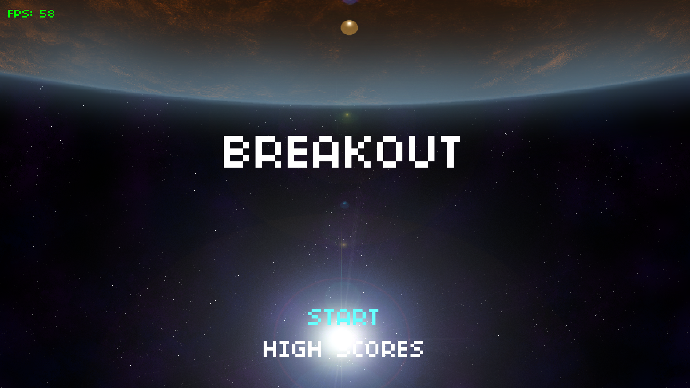
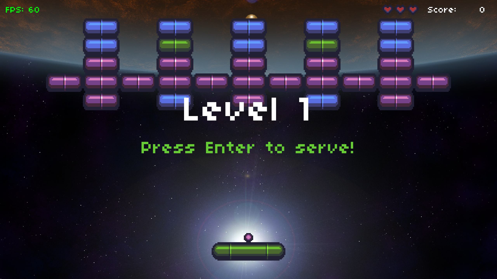

# Breakout

CS50G Breakout (Assignment #2)

Original code [by Colton Ogden](https://cs50.harvard.edu/games/2018/projects/1/flappy/)

Assignment:

1. ~~Add a powerup to the game that spawns two extra Balls.~~
2. ~~Grow and shrink the Paddle when the player gains enough points or loses a life.~~
3. ~~Add a locked Brick that will only open when the player collects a second new powerup, a key, which should only spawn when such a Brick exists and randomly as per the Ball powerup.~~

# Screenshots

## Opening Screens

## Powerups

# Bugs and Todos

* I think the game generates too many lives, some games never seem to end.
* High scores should be updated after every level instead waiting for the player to lose all lives. If the player quits before losing all lives no high score is recorded.
* It can be very frustrating when you're down to one brick at the ball consistently misses it...
* Speaking of frustration, the "increase paddle size" and "decrease paddle size" powerups look very similar...

# Credits

* Background image by [Bart Kelsey](https://opengameart.org/users/bart) via [Open Game Art](https://opengameart.org/content/red-planet-2)
* Music also by [Bart Kelsey](https://opengameart.org/users/bart) via [Open Game Art](https://opengameart.org/content/xeon-theme-remastered)
* Using [boon](https://github.com/camchenry/boon) to package releases
